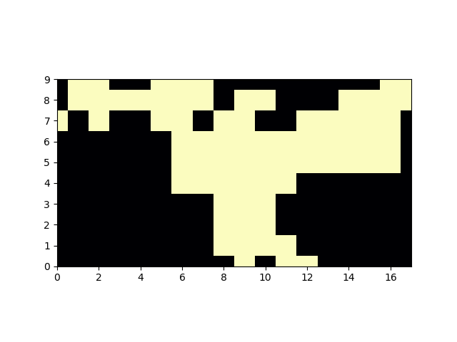
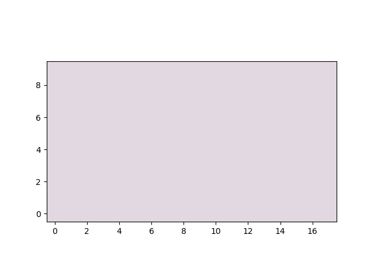
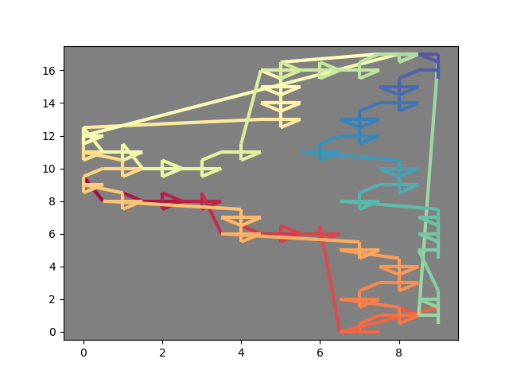
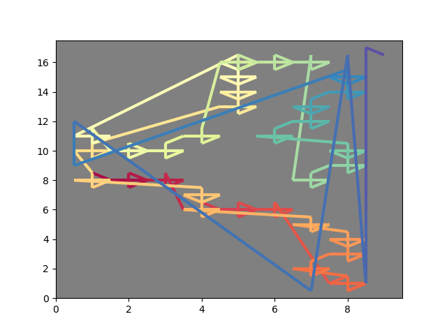

In [`sprint_notes.md`](sprint_notes.md) I gave a detailed description of how I tracked down
the source of the bug preventing the faster convex hull retrieval function from being added
to `scikit-image`.

It's quite heavy on the detail, and this makes it hard to think clearly about the pertinent
part, so next I am going to solely discuss the specific bug identified as taking place
within the function `_offset_diamond`.

## Simplify the test case into a pass and a fail

Firstly, I copied `test_convex_area.py` to `simple_test_convex_area.py` and discarded the
bug reproducing functions except the final ones: `no_bug_5ary` and `bug_5ary`, renamed to
`no_bug` and `bug`, moved the `SAMPLE` data variable to a helper module `sample_data.py`,
and removed the imports that were then no longer in use.

## Refactor the test cases into subroutines and DRY

Secondly, I refactored all the common subroutines into functions `common_subroutine_1`
and `common_subroutine_2`, which has the side benefit of clarifying where the subroutines
modify the value of their inputs (in which case the function returns the inputs to be
reassigned when returning from the subroutine).

In fact, refactor the `common_subroutine_1` out of the bug functions entirely (as it
really is a mechanism for providing a default argument by proxy), and instead set the
default argument in the main function which then passes the default arguments into the
bug functions.

## Refactor any other unnecessary parts

I removed the assignment of `ndim` which seemed to be a careful approach in case `img.ndim`
changed, but it wasn't, so I just access `img.ndim` after passing the same value to
`_offsets_diamond`.

- Note that the subroutines really help clarify the logic blocks here and what is/isn't changed
  from one part of the code to the next by simply reading the arguments to and assignments from
  the subroutines
  - (as in this program all state changes are direct/procedural not stored/connected through
    objects, inheritance, side effects, etc.).

The `nobug` function doesn't need the `if rets` part, as it's only used to control the `bug`.

---

## Re-examining the source of the IndexError

The main target of this investigation was an `IndexError`, and in the previous step I honed in
on the following 2 lines in `bug`:

```py
offsets = _offsets_diamond(img.ndim)
coords = (coords[:, np.newaxis, :] + offsets).reshape(-1, img.ndim)
```

- `offsets` is a numpy array of "jitter" (or something similar), i.e. it provides a little
  perturbation of +/- half a pixel to one of the two coordinates at a time (i.e. 4 sub-pixels).

- `coords` is reassigned, by broadcasting this 4-row-by-2-column array with each row (coordinate pair)
  of the input coordinates
  - which are all discrete, i.e. it "jitters" the discrete integer-valued pixels to half-pixels in
    all possible directions [one coordinate only at each time]

This isn't what causes the `IndexError` though, that happens when these `coords`, after being
rounded up and down [thereby sending the half-pixel jitter a full pixel away] are used to index
a mask, which was created by zeroing an array with the same shape as the input image (`img`).

When this happens, the `IndexError` is specifically for the value 10, which came from the 9.5
rounding, i.e. from the `[0,9]` + `[0,0.5]` --> `[0,9.5]` --> `[0,10]`

- It's not clear whether there's also a problem due to the 0 in `[0,9]` being rounded down to
  `[-1,9]` by the `[-0.5, 0]`: perhaps this could mistakenly be accessing the last element of the
  dimension (`x[-1]` indexes the last element of `x`). Ignore this for now.

---

The problem seems to arise when the coords are passed with invalid values, so one solution would
be to simply overwrite these invalid values before passing them to `ConvexHull`.

This could be as simple as

```py
coords[coords[:,0] == coords[:,0].min()] += [0.5, 0.]
coords[coords[:,1] == coords[:,1].min()] += [0., 0.5]

coords[coords[:,0] == coords[:,0].max()] -= [0.5, 0.]
coords[coords[:,1] == coords[:,1].max()] -= [0., 0.5]
```

Running this resolves the bug:

```STDOUT
nobug raised no error.
bug raised the IndexError index 10 is out of bounds for axis 0 with size 10
bugfix raised no error.
```

However it's 4 lines, and it'd be more elegant to do it in one, specifically
it'd be better if we could only add the offsets to the appropriate lines,
rather than modifying and then undoing the modifications (particularly as this
will scale with image size, and the whole point here was to increase the speed
of the convex hull function).

## Adding offsets only to the non-extremal pixels

The minimum and maximum pixels (or extremal pixels) is more simply just the border.
We don't want to add offsets at the border in other words.

Again let's make a simplified test case to look at this more closely: `simple_coord_offset.py`

The `offsets` can be seen as 4 rows:

- `rm` (row minus)
- `rp` (row plus) 
- `cm` (col minus)
- `cp` (col plus)

```py
>>> offsets
array([[-0.5,  0. ],
       [ 0.5,  0. ],
       [ 0. , -0.5],
       [ 0. ,  0.5]])
```

Likewise the image border subset of `coords` can be split into 4 edges,
which correspond to the offsets in that each edge forbids one type of offset:

- `left` (row min): forbids `rm`
- `right` (row max): forbids `rp`
- `top` (col min): forbids `cm`
- `bottom` (col max): forbids `cp`

```py
rm, rp, cm, cp = offsets
```

For the purposes here, ignore the fact that vertical image axes may go the opposite way
around, let's just consider the numpy array.

This means that we can construct the `coords` + `offset` calculation in 4 calls,
whose pseudo-code will be along the lines of:

```py
coords[!= left edge of img] += rm
coords[!= right edge of img] += rp
coords[!= top edge of img] += cm
coords[!= bottom edge of img] += cp
```

This is (obviously) not simply starting at 1/stopping at -1 like so:

```py
coords[:,1:] += rm # not left
coords[:,:-1] += rp # not right
coords[1:,:] += cm # not top
coords[:-1,:] += cp # not bottom
```

as the `coords` is not the `img` but simply a store of coordinates on the `img`, i.e.
the values cannot be split into the subsets based on their position within the numpy array
(`coords`) itself!

To retrieve the edges, we must get the indices of the `coords` array where the value of 
the row is (leftmost/rightmost) and the col is (topmost/bottommost), then apply the
appropriate offsets.

```py
x_min, y_min = 0, 0
x_max, y_max = np.subtract(img.shape, 1)
not_l = coords[:,0] != x_min
not_r = coords[:,0] != x_max
not_t = coords[:,1] != y_min
not_b = coords[:,1] != y_max
```

We can quickly review that these are correct with a rough sketch:

```py
edit_img = np.copy(img).astype(int) * 255
seen = []
excludes = [not_l, not_r, not_t, not_b]

for exclude in excludes:
    exc_coords = pre_coords[exclude]
    exc_r, exc_c = exc_coords[:,0], exc_coords[:,1]
    img_exc = edit_img[exc_r, exc_c]
    mid_indx = np.argwhere(np.logical_and(0 < img_exc, img_exc < 255)).reshape(-1)
    max_indx = np.argwhere(img_exc == 255).reshape(-1)
    mid_r, mid_c = exc_r[mid_indx], exc_c[mid_indx]
    max_r, max_c = exc_r[max_indx], exc_c[max_indx]
    edit_img[mid_r, mid_c] += 40
    edit_img[max_r, max_c] = 40
    include = np.invert(exclude)
    include_coords = pre_coords[np.argwhere(include).reshape(-1)]
    seen.append(include_coords)

plt.imshow(edit_img)
plt.show()
```

This doesn't look right at all, so to inspect what happens we can animate it as it builds!

```py
edit_img = np.copy(img).astype(int) * 255
seen = []
frames = []
excludes = [not_l, not_r, not_t, not_b]

frames.append(np.copy(edit_img)) # initial
for exclude in excludes:
    exc_coords = pre_coords[exclude]
    exc_r, exc_c = exc_coords[:,0], exc_coords[:,1]
    img_exc = edit_img[exc_r, exc_c]
    mid_indx = np.argwhere(np.logical_and(0 < img_exc, img_exc < 255)).reshape(-1)
    max_indx = np.argwhere(img_exc == 255).reshape(-1)
    mid_r, mid_c = exc_r[mid_indx], exc_c[mid_indx]
    max_r, max_c = exc_r[max_indx], exc_c[max_indx]
    edit_img[mid_r, mid_c] += 40
    frames.append(np.copy(edit_img)) # update
    edit_img[max_r, max_c] = 40
    frames.append(np.copy(edit_img)) # update
    include = np.invert(exclude)
    include_coords = pre_coords[np.argwhere(include).reshape(-1)]
    seen.append(include_coords)
```

Then to view the frames in animation we just need:

```py
from matplotlib.animation import FuncAnimation
fig = plt.figure()
shape = edit_img.shape
ax = plt.axes(xlim=(0, shape[1]-1), ylim=(0, shape[0]-1))
a = edit_img
im = plt.imshow(a, interpolation="none", cmap=plt.get_cmap("magma"))

def init():
    im.set_data(a)
    return [im]

# animation function.  This is called sequentially
def update(frame):
    print(frames)
    print()
    im.set_array(frame)
    return [im]

ani = FuncAnimation(fig, update, frames=frames, init_func=init, blit=True)
ani.save("edge_omit_fail_animation.gif", writer="imagemagick", fps=10)
plt.show()
```

- (Actually, there was a small extra step to avoid duplicate frames, see
  [anim_simple_coord_offset_draft.py](anim_simple_coord_offset_draft.py)) for the full script used to make
  the animation below:



...which shows that it's modifying all the wrong nodes!

I should ensure min and max are for the extremal pixels of the border of `img`,
not the border of the hull coords (I think?)

Actually, I needed to use `functools.reduce` to apply `np.logical_and` over the 4 edge bool masks,
i.e. to take the logical union of the `not_edge` mask to indicate where was not any type of edge,
and then use that to filter the `pre_coords` i.e. to take a subset of the `coords` to add the offset
to.

- The `cmap` colour scheme here is `twilight` which has white ends: so both the background and the inside
  are shown as white (whereas in actual RGB value, the outside was being shown as black). This just helps
  to display the actual modification here so it's clear that the edges are being omitted, and you
  can visually ignore both the regions of 0 and 255.
- I also decremented the `xlim` and `ylim` arguments to `plt.axes` by `-0.5` to show entire pixels



## Applying the offset to the subset of coords and merging with the non-offset coords

It's important to ensure that the un-offset edge coords are not discarded here though, so
we need to 'hold them back'.

I tried to do this but for now they do not give the same exact result, so I'll have to dig into why.

```sh
python partial_coord_offset.py
```
⇣
```STDOUT
bugfix_draft raised no error.
bugfix_new raised no error.
Bug fixes give same result: False
```

When I visualise the results, it's clear that the new points were not introduced in the clockwise order they
began at, and that I need to be more careful to insert them back from whence they came!

This is easily visualised using a gradient line ([`gradient_line.py`](gradient_line.py))

Here is the result from the "offset first, undo invalid modifications later" approach:



Here is the result from the "select the non-edge offsets, then apply modifications there, then apply
valid offsets to individual edges, then concatenate to the non-edge offset coordinates" approach:



It's clearly no good and it's easy to see why the `ConvexHull` result gives an entirely different
mask...

## Retaining the order of points by avoiding reshape

Let's consider more closely at what precise step the order of points is lost (and therefore where
to intervene to retain it in the output `coords`).

The "simple" approach in `bugfix_draft` is:

```py
coords = (coords[:, np.newaxis, :] + offsets).reshape(-1, img.ndim)
```

In this expression, the `[:, np.newaxis, :]` means "keep the rows the same but in each row, make
every entry a new array, whose only element is the entry that was there", or in other words, turn
every row of entries into a row of singleton arrays, each of which contain the pre-existing entry.

Now we can step in before this point, and just perform this singleton transformation:

This is instead replaced by the following function:

```py
def apply_partial_offsets(img, coords, offsets, retain_original_points=True):
    "Apply the offsets only to the non-edge pixels, along with the trivial zero-offset."
    if retain_original_points:
        # Insert the trivial offset of [0., 0.] into `offsets`
        offsets = np.insert(offsets, 0, 0., axis=0)
    row_max, col_max = np.subtract(img.shape, 1)
    # bool masks for the subsets of `coords` including each edge (one edge at a time)
    edge_t, edge_b = [coords[:,0] == lim for lim in (0, row_max)]
    edge_l, edge_r = [coords[:,1] == lim for lim in (0, col_max)]
    edge_includers = [edge_t, edge_b, edge_l, edge_r]
    if retain_original_points:
        dummy_edge = np.zeros_like(edge_t, dtype=bool) # all False so offset always applied
        edge_includers.insert(0, dummy_edge)
    offset_mask = np.invert(edge_includers).T
    offset_idx = np.argwhere(offset_mask.ravel()).ravel()
    coords = (coords[:, np.newaxis, :] + offsets).reshape(-1, img.ndim)[offset_idx]
    return coords
```

This function:

- Places a "trivial" offset at the start of the `offsets` array (which came from `_offset_diamond`)
  i.e. `[0., 0.]`, which will not change the location of the 
